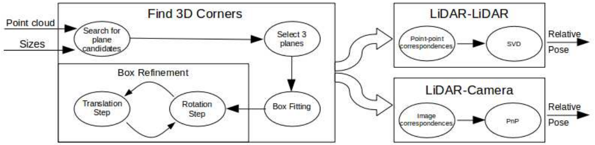
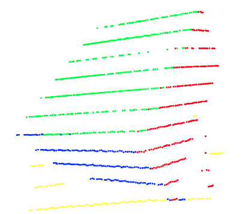
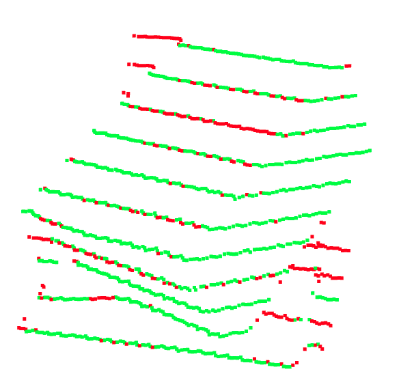
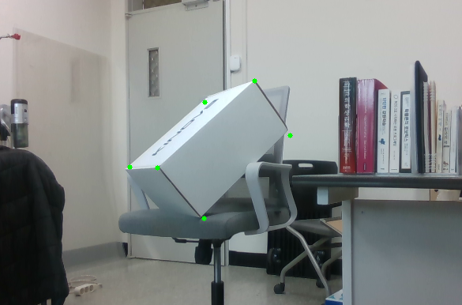

# LiDAR_Camera_Calibration_using_Ordinary_box

Introduction
------------
This repository is created for the purpose of analyzing and conducting research on the [code](https://github.com/kdh2769/LiDAR_Camera_Calibration_using_Ordinary_box)

* Official [paper](https://openaccess.thecvf.com/content_ICCV_2017_workshops/w6/html/Pusztai_Accurate_Calibration_of_ICCV_2017_paper.html).

Result
------

This repo follows under step.
<figure>
  
</figure>

1. Search for plane candidates and find outliers
<p>
   
  
</p>

2. Select 3 planes and box fitting
<p>
  
</p>

3. Box refinement
<p>
  
  
</p>

4. Reprojection
<p>
  
</p>


Dependencies
------------
It is tested with opencv-4.2.0 
Visualization used Matplotlib3D and Open3D.

This repo reused 3d ransac code from ``pyranscas3d/plane.py`` [code](https://github.com/leomariga/pyRANSAC-3D/blob/master/pyransac3d/plane.py)

This repo reused 3d ransac code from ``Owner avatar
LiDAR_Camera_Calibration_using_Ordinary_box `` [code](https://github.com/kdh2769/LiDAR_Camera_Calibration_using_Ordinary_box)


Citation
-------- 
```
Mariga, L. (2022). pyRANSAC-3D (Version v0.6.0) [Computer software]. https://doi.org/10.5281/zenodo.7212567

@InProceedings{Pusztai_2017_ICCV,
    author = {Pusztai, Zoltan and Hajder, Levente},
    title = {Accurate Calibration of LiDAR-Camera Systems Using Ordinary Boxes},
    booktitle = {Proceedings of the IEEE International Conference on Computer Vision (ICCV) Workshops},
    month = {Oct},
    year = {2017}
}
```
